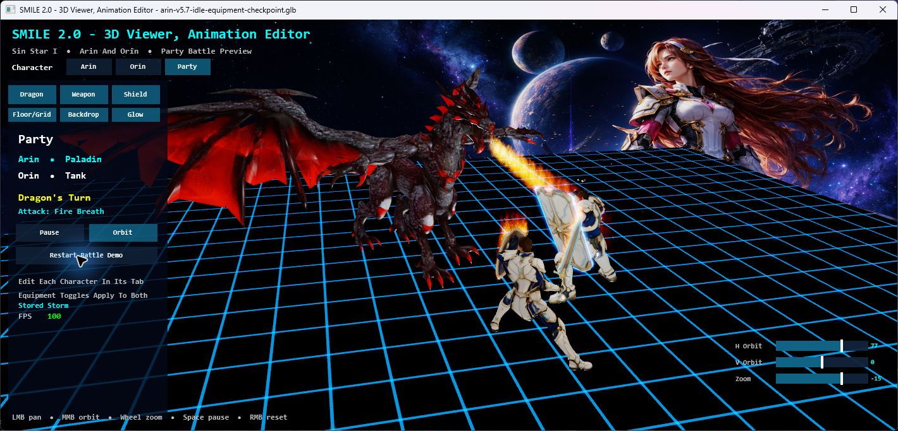
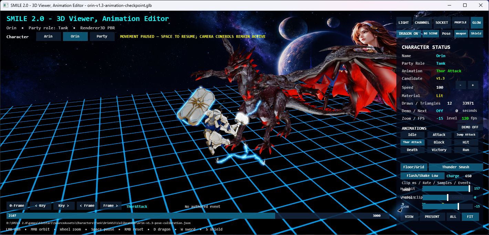
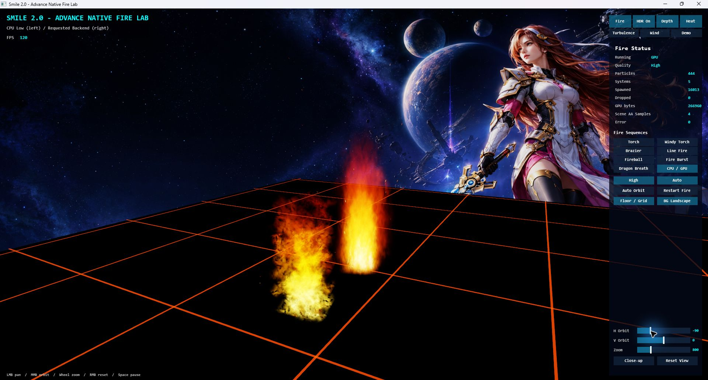
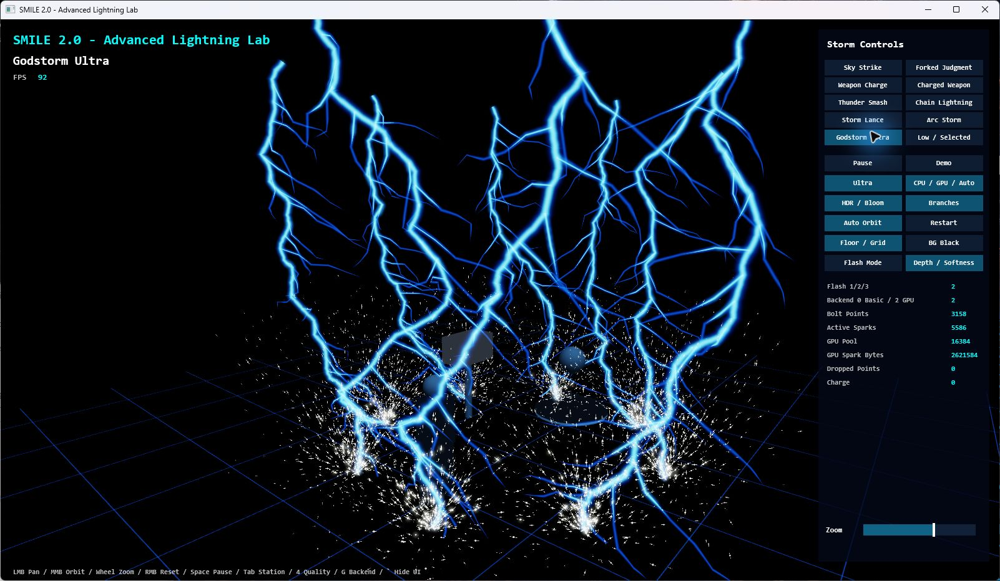
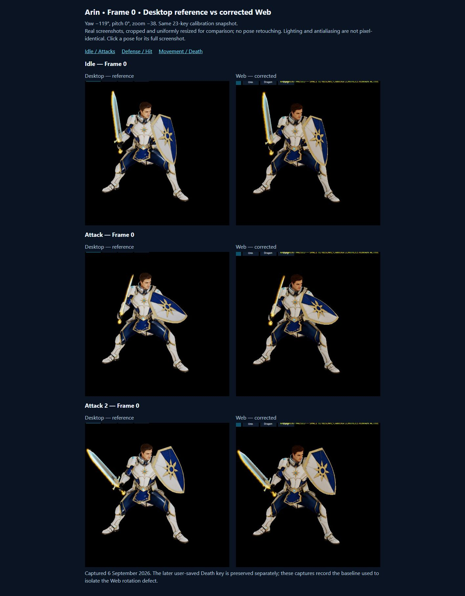

<p align="center">
  
</p>

# SMILE 2.0

### Simple Modern and Intuitive Language for Everyone

SMILE is a friendly programming language with an ambitious mission: make the
journey from a first readable program to a real game feel natural, creative,
and rewarding.

SMILE 2.0 is evolving in public as a complete language, compiler, runtime,
Visual Studio experience, and growing game-creation toolkit. The same SMILE
source can become a native Windows application or a browser experience. Its
current work stretches from classic 2D games to animated 3D characters,
cinematic battles, reusable visual effects, and artist-friendly tools—without
giving up the clarity that makes BASIC-style programming approachable.

> **The vision:** a language simple enough to learn, capable enough to grow
> with its creator, and expressive enough to build worlds worth sharing.

## See what SMILE can do

### Real-time character animation and battle presentation

The SMILE 2.0 Character Viewer and Animation Editor includes Arin, Orin and the
Red Dragon, plus locally licensed Valor, Zara and Vrax packages. It supports animation playback,
timeline inspection, pose calibration, equipment and effects, individual
character views, and a live party-versus-boss demonstration.

<p align="center">
  
</p>

The Viewer is more than a showcase. It is becoming the practical bridge
between imported character art and dependable in-game performance: grounding
feet, correcting poses, aligning weapons and shields, previewing effects, and
preserving character-specific calibration across native and Web builds.

### Fire and lightning built as reusable systems

<table>
  <tr>
    <td width="50%" align="center"><b>Advanced Fire VFX Lab</b></td>
    <td width="50%" align="center"><b>Advanced Lightning VFX Lab</b></td>
  </tr>
  <tr>
    <td></td>
    <td></td>
  </tr>
</table>

Fire and lightning are developed as scene-level capabilities rather than
one-off tricks. The labs explore flames, smoke, heat, bloom, branching arcs,
sparks, impact flashes, resource limits, and graceful fallback behavior. Those
same foundations can serve weapons, characters, bosses, and future scenes.

### One creative result, two destinations

Native Windows remains SMILE's first priority, while Web publication makes the
same projects easy to share. Recent parity work aligned character poses,
equipment, animation timing, controls, and rendering behavior across both
targets.

<p align="center">
  
</p>

Web projects can now be published in four forms: full fidelity or optimized
Low, Medium, and High profiles. This gives creators a practical choice between
maximum visual quality and smaller downloads for limited hosting space or
slower connections. Canonical art and native builds remain untouched.

## Why this project matters

SMILE 2.0 is both a product and an engineering journey. It demonstrates how a
language can grow deliberately from readable syntax into a complete creative
platform:

- **For learners:** familiar, explicit code with a gentle path into graphics,
  sound, games, reusable modules, and larger programs.
- **For game creators:** native and Web output, 2D and 3D rendering, input,
  audio, persistence, UI, RPG systems, animation, and VFX under one coherent
  project model.
- **For developers:** a real compiler, semantic model, runtime, Visual Studio
  integration, deterministic asset pipeline, cross-target validation, and
  production-minded ownership and lifecycle rules.
- **For collaborators and partners:** a visible long-term direction that joins
  education, game technology, visual tooling, and approachable language design.

The project values working increments over speculative rewrites. New
capabilities are added to the same language and architecture, proved in real
programs, and then reused by the next milestone.

## Recent progress

The latest milestones moved SMILE decisively toward modern 3D game creation:

- Built a native-and-Web Character Viewer and lightweight Animation Editor for
  Arin, Orin, the Red Dragon, and party battle playback.
- Preserved character-specific animation packages and calibration while fixing
  grounding, pose, equipment, targeting, interaction, and lifecycle defects.
- Added reusable fire and lightning laboratories with scene-owned effects and
  bounded resource behavior.
- Hardened mouse, keyboard, timeline, orbit, pan, zoom, WebGL recovery, and
  actor-instance isolation across native Windows and Chrome.
- Added full, Low, Medium, and High Web deployment profiles and made Windows
  64-bit the default across the repository's SMILE solutions.
- Continued expanding a portfolio of complete SMILE games, reusable libraries,
  and Visual Studio tooling—all using the shared language implementation.

Current behavior, build/publication requirements and validation routes live in the
[Viewer README](tools/Character3DViewer/README.md) and
[architecture index](docs/architecture/README.md).

## Games that prove the language

SMILE's games are not native demonstrations hiding behind a scripting layer.
Their rules are written in `.smile` source and exercise the same language that
students and creators use.

| Experience | What it explores |
| --- | --- |
| **Snake** | A welcoming first complete game with scoring, sound, persistence, and a teaching edition. |
| **SMILE 2.0 Tetris** | Falling-piece logic, rotation, rows, levels, and responsive play. |
| **Paddle Ball** | One-player AI and local two-player action. |
| **Brick Breaker** | Multi-level arcade structure, lives, scoring, and colorful presentation. |
| **Dungeon Star I & II** | Editable worlds, pseudo-3D exploration, raycasting, doors, collision, and procedural maps. |
| **Maze Muncher** | A neon maze chase with enemies, power mode, progression, and attract play. |
| **Space Wars** | A vector-style 3D rail shooter built on SMILE's educational Simple3D library. |
| **Dragonfall** | A fully staged Renderer3D party battle with roles, enemies, a two-phase dragon, cameras, and effects. |
| **Sin Star I** | The long-term RPG home for Arin, Orin, the Red Dragon, world systems, and the coming cinematic battle workflow. |

## SMILE 2.0 Studio: current status and next action

The accepted [Studio design](docs/architecture/2026-09-09%20-%20SMILE%202.0%20Studio.md) defines one thin application host with
Character Viewer, Character Editor, Animation Editor, a general Scene Editor,
VFX and Audio workspaces. It supersedes battle-only editor plans and separate
required editor applications. Existing Viewer and labs remain working standalone
tools until their workflows are hosted through the same implementations.

Sin's September 10 [current working visual design and UI breakdown](docs/architecture/studio-visual-design.md)
preserve the [original Studio reference image](docs/architecture/images/smile-2.0-studio-working-design-2026-09-10.jpg).
This is the visual target for Studio until Sin explicitly changes it; pictured
controls describe design intent and do not establish implementation status.

The current compiler/runtime supports shared 2D/3D, animation, calibrated equipment,
Fire/Lightning, audio, persistence, mandatory startup branding and Double precision.
Studio now has a [bounded hosted Viewer and Character Editor](tools/SmileStudio/README.md),
with a permanent [Visual Studio solution](tools/SmileStudio/SmileStudio.slnx) and
linked shared Viewer modules. Its native/Web shell follows the working visual
composition. General scene documents, reusable saved-effect/audio definitions,
Water, declarative scene authoring and faithful scene export remain **planned**.
The four accepted extensions are `.smilestudio`, `.smilescene`, `.smilevfx` and
`.smileaudio`; the design examples are not implemented loader schemas or grammar.

| Next work / owner | Dependency and focused acceptance | Completion boundary |
|---|---|---|
| Hosted Viewer acceptance / existing Viewer lifecycle and input owners | Finish human native/Chrome slow and moderate camera gesture acceptance; preserve source-matched automated save/failure/lifecycle evidence | Existing single session and renderer serve both callers; do not declare full S1 acceptance before remaining observations pass |
| Character/animation documents / calibration owners | Explicit shared session, dirty state, save/undo and source-versus-scene ownership | Workspace changes preserve the same edited resource and failed saves preserve valid bytes |
| Reusable assets and general scenes / shared asset, VFX/audio and scene owners | Validated JSON, project publication, independent instances and bindings; first Fire recipe before new families | Runtime loaders have no Studio dependency; no fixed party/combat requirement |
| Declarative/export parity / shared language and scene owners | Shared scene semantics; real compiler, both export modes and standalone execution | One machine-readable capability register with generated `scene-feature-parity.md`; missing counterparts explicit |

Readiness: **S1 IMPLEMENTED; FINAL INTERACTION ACCEPTANCE ON HOLD**. Studio and
the standalone Viewer own their respective entry points and consume one shared
`ViewerWorkflow.Session`. Existing focused owners retain rendering, input, actor,
calibration, effects and audio behavior. The hosted workflow supports clip selection,
pose preview/Save/Undo, dirty-close protection and Stop/Resume. Its Inspector and
Timeline reflect that same session. Scene/Code/Visual and future workspaces are
visibly planned, not functioning editors. Generic asset loading and Water are not
prerequisites for this slice and are not started by it.
The capability register belongs to the shared scene/asset contract owner when the
first such capability is implemented; no empty green parity table is created now.

Current limits remain explicit: imported Valor/Zara/Vrax rigs do not expose pose
editing; concurrent calibration saves are not merged; CPU VFX fallback is simpler
than High/GPU; Dragon's optional retarget trial is an approximation with an Original
restore option. Further semantic-inspection CLI work requires its own bounded
specification. These are not blockers for hosting one existing supported workflow.

SMILE 1.0, 2.0 and proposed 3.0 continue with a shared-core direction where practical.
SMILE 2.0 is authoritative for core evolution; compatibility moves forward and any
missing legacy text/console capability needs an explicit alignment path. Studio
and richer 3D evolve the current implementation rather than replacing its engine.

On Hold: SMILE Studio creation/development/acceptance/next phases, and all Web
adoption/publication/browser validation. Clearing a hold does not automatically
start an unrelated phase.

## Try it

### What you need

- Windows 11 x64
- .NET SDK 10.0.400, selected by `global.json`
- Visual Studio 2026 with Desktop development with C++ and Visual Studio
  extension development
- Node.js 20 or newer for Web checks

Check the machine without installing or changing anything:

```powershell
powershell -NoProfile -ExecutionPolicy Bypass -File scripts\doctor.ps1
```

Build the compiler and Visual Studio extension:

```bat
scripts\build.cmd
```

The primary outputs are:

```text
artifacts\compiler\smilec.exe
artifacts\vsix\Smile.VisualStudio.vsix
```

Open any included game solution in Visual Studio, or use the SMILE project
template to start something new. Application projects offer these deployment
targets:

- Windows 64-bit `.exe` — the default
- Web — full fidelity
- Web - Optimized Low
- Web - Optimized Medium
- Web - Optimized High

Newly compiled native and Web programs include the official SMILE startup logo,
creator credits, and the artifact's compilation timestamp/version. The logo stays
visible for at least one second while loading proceeds. Web distinguishes overall
preparation from the current asset's actual download progress. No source changes
or optional imports are required. See [startup behavior and compatibility](docs/language/phase4-media.md#nativeweb-startup-and-reusable-downloads).

For deeper implementation and language material, start with the
[language documentation](docs/language/README.md) and the milestone reports
under `docs/implementation`.

## Project principles

- Keep the language friendly and readable.
- Build real programs that prove each new capability.
- Share one language and semantic model between compiler and editor.
- Keep native Windows first and Web second without splitting the source
  language.
- Preserve 2D as a first-class strength while growing modern 3D support.
- Prefer small, reusable improvements over replacement frameworks.
- Treat assets, saves, actor state, effects, and playback ownership carefully.
- Record evidence honestly; never call unfinished work complete.

## Creator and collaboration

SMILE 2.0 is created and programmed by **Louiery R. Sincioco (Sin)** with Codex
collaboration. The repository welcomes thoughtful interest from educators,
language and compiler developers, game creators, technical artists, prospective
employers, business partners, and investors who connect with its mission.

- [GitHub](https://github.com/Sincioco)
- [LinkedIn](https://linkedin.com/in/louierysincioco)
- [YouTube](https://youtube.com/@TheSincioco)
- [Facebook](https://facebook.com/louiery.sincioco)
- [TikTok](https://tiktok.com/@sincioco)
- Email: [louiery@gmail.com](mailto:louiery@gmail.com)

---

**SMILE 2.0 — Simple Modern and Intuitive Language for Everyone.**

Copyright(c) 2026. All rights reserved. Programmed by Louiery R. Sincioco (Sin).
