<p align="center">
  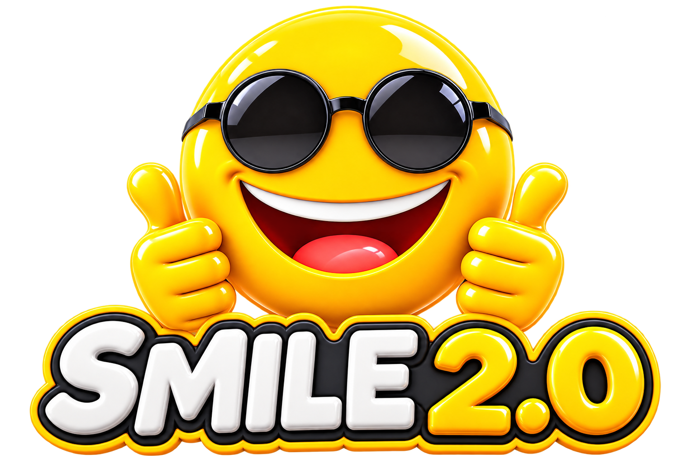
</p>

<h1 align="center">SMILE 2.0</h1>
<p align="center"><strong>Simple Modern and Intuitive Language for Everyone</strong><br>
A readable language. A native compiler. A world taking shape.</p>

<p align="center">
  <a href="#latest-progress--the-native-battle-system">Latest Progress</a> ·
  <a href="#earth-lab--giving-kael-the-power-to-move-stone">Earth Lab</a> ·
  <a href="#fire-lab--choreographing-flame">Fire Lab</a> ·
  <a href="#water-lab--shaping-flow-and-impact">Water Lab</a> ·
  <a href="#sin-star-i--from-script-to-screen">Sin Star I Trailer &amp; Story</a> ·
  <a href="#build-and-explore">Build &amp; Explore</a> ·
  <a href="#work-with-sin">Work With Sin</a>
</p>

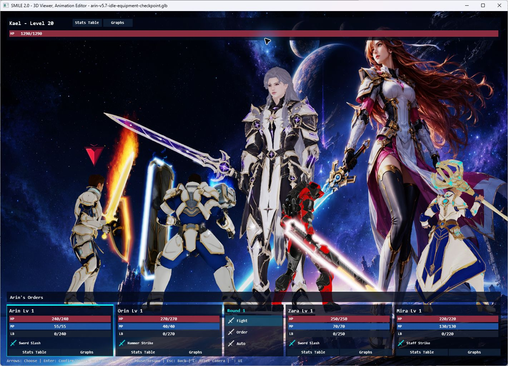

*Latest native Battle System: four heroes, one towering opponent, and the language and tools behind the scene.*

**SMILE 2.0 is a programming language and game-development toolchain created by
Louiery R. Sincioco (Sin), with Codex collaboration.** It brings together a shared
language and semantic model, a native Windows compiler, rendering and audio
runtimes, reusable SMILE libraries, and Visual Studio integration.

Its current creative focus is **Sin Star I**, a science-fantasy RPG in development.
Much of the hands-on progress happens in the **3D Character Viewer and Animation
Editor**: bringing characters to life, refining equipment and poses, building
reusable effects, and turning party choreography into interactive battles.

**Development snapshot: September 24, 2026.** The thirteen Viewer and VFX Lab
screenshots on this page were captured from the native applications for this
update. The story illustrations and trailer below are separate creative-production
material. Sin Star I is a work in progress.

## Latest progress — the native Battle System

The Viewer now opens directly into a battle against **Kael**, with **Arin, Orin,
Zara and Mira** as the party. This latest slice adds playable decisions to the
existing character, animation and effects workflow:

- **Party orders:** select attacks, magic, healing targets, Defend, Limit Break or Run.
- **Automatic rounds:** repeat remembered orders, then request new ones at a round boundary.
- **Battle feedback:** HP, MP, Limit Break gauges, floating damage/healing and a crystal order pointer.
- **Progression:** EXP rewards, level growth, statistics tables and graphs for the current session.
- **Presentation:** a cinematic opening, action cameras, victory animations and automatic encounter restarts.
- **Hands-on inspection:** pause the battle while keeping smooth camera pan, orbit and zoom available.

The **Battle System** and **Kael Party** are distinct views: one runs interactive
combat; the other demonstrates the character choreography and effects.

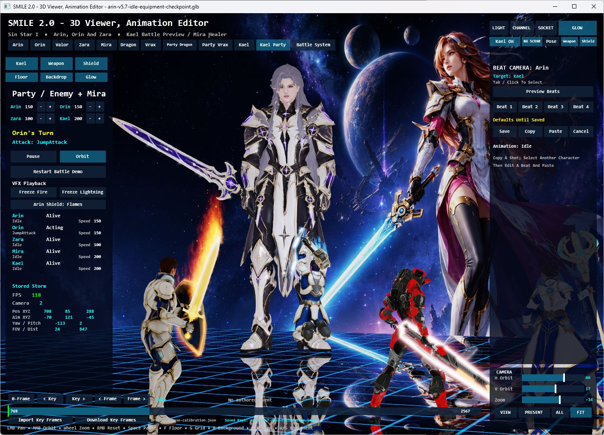

*Kael Party in the native Viewer. The editor exposes playback, camera beats,
equipment and effects alongside the live scene.*

[Explore the Battle System and controls](tools/Character3DViewer/README.md#native-battle-system)
· [Read the ownership and validation notes](tools/Character3DViewer/ARCHITECTURE.md)

## Earth Lab — giving Kael the power to move stone

**Boulder Hurl. Stone Volley. Fault Line.** The new native Earth Lab pairs Kael's
planted stances and two-handed casts with lifted rocks, flying fragments, dust,
impact cues and a reflective arena. His sword disappears during the cast so the
motion reads clearly, then returns for normal sword animation.

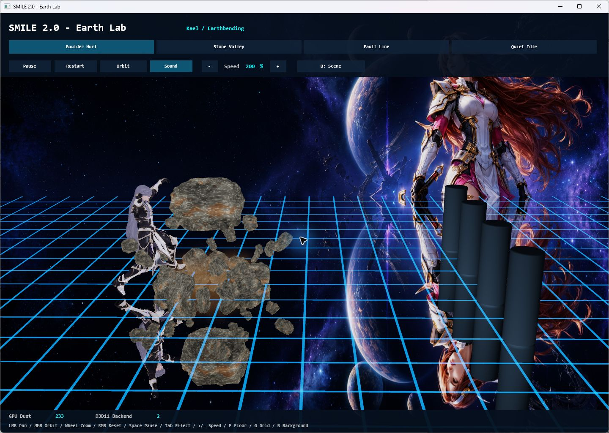

*Boulder Hurl — body motion, stone lift and reflected geometry in the native renderer.*

<table>
  <tr>
    <td width="50%">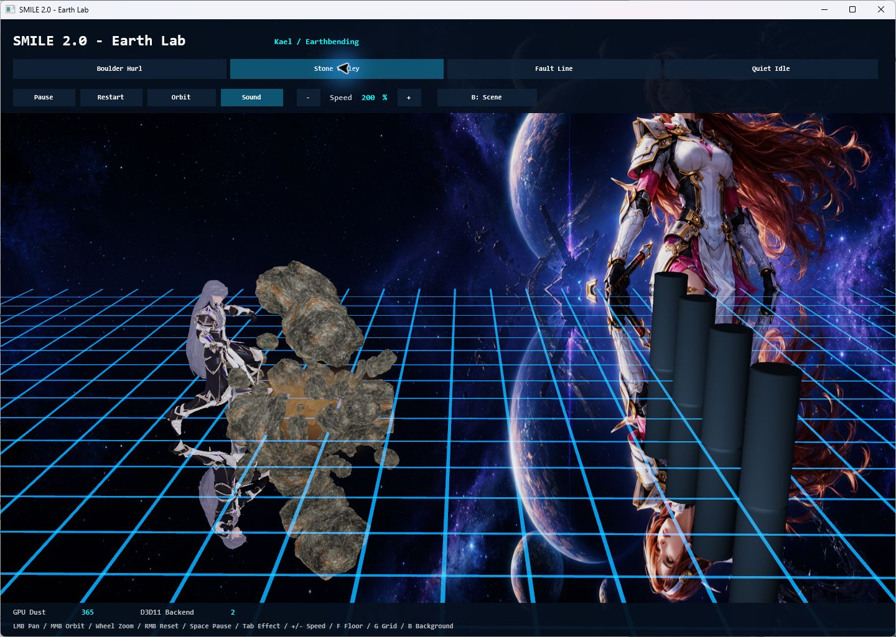</td>
    <td width="50%">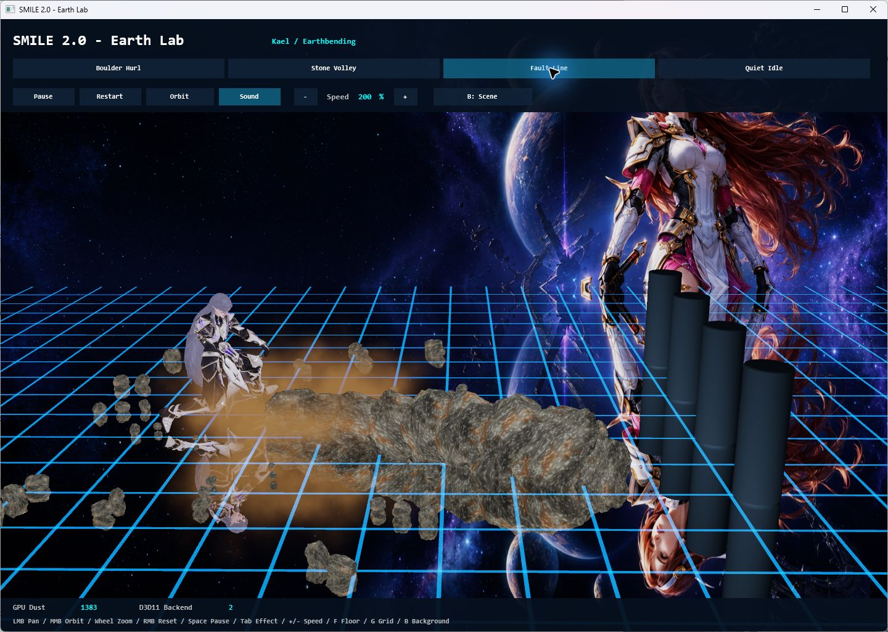</td>
  </tr>
  <tr>
    <td><strong>Stone Volley</strong><br>Three successive thrusts send stone toward a selected target.</td>
    <td><strong>Fault Line</strong><br>A downward strike drives the effect across the arena.</td>
  </tr>
</table>

This is reusable SMILE code: the Earth effect owns rocks and dust independently
of Kael, while his adapter supplies animation timing and targets. The same casts
are already used in the native Viewer and Sin Star I's Kael presentations.

[Explore Earth Lab and its controls](tools/EarthVfxLab/README.md)
· [Inspect the shared Earth effect](libraries/Smile.Simple3D/EarthVfx3D.smile)

## Fire Lab — choreographing flame

**Ember Strikes. Flame Sweep. Inferno Blast.** The native Fire Lab connects
Kael's punches, sweeping kick and two-handed release to jets emitted from his
animated hands and foot. Bright flame cores, embers, heat distortion and cooling
smoke make each motion visible across the reflective arena.

<table>
  <tr>
    <td width="50%">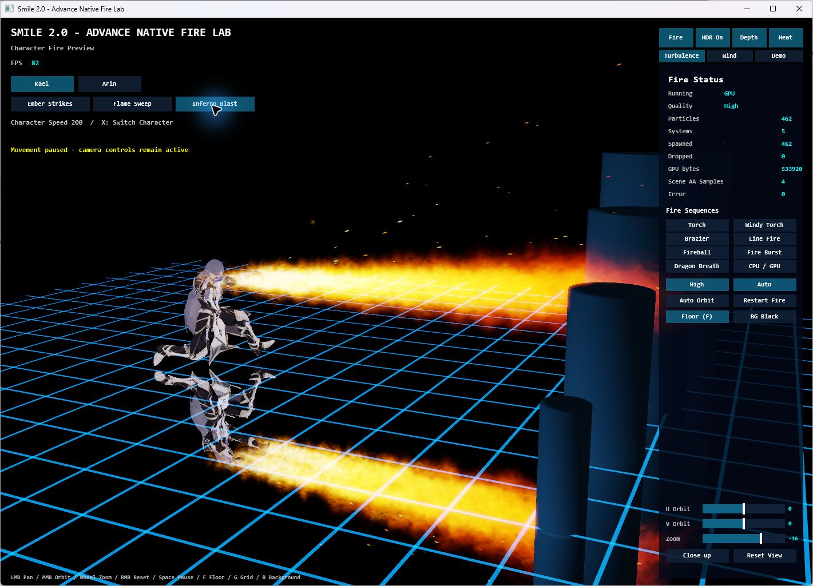</td>
    <td width="50%">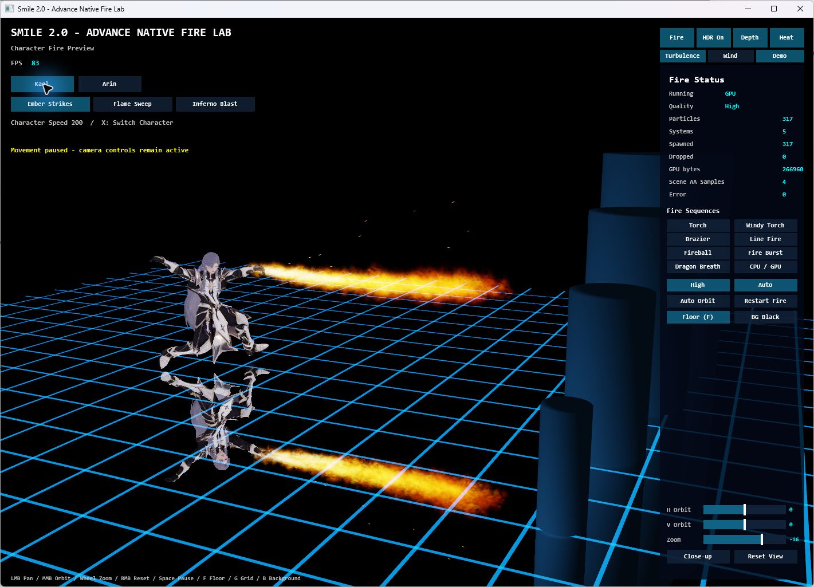</td>
  </tr>
  <tr>
    <td><strong>Inferno Blast</strong><br>A low lunge and two-handed release drive a broad jet toward the targets.</td>
    <td><strong>Ember Strikes</strong><br>Chambered punches send fire forward from the animated hands.</td>
  </tr>
</table>

The Lab also previews Arin's sword and shield flames and standalone effects such
as torches, fireballs and dragon breath. Playback can pause while the camera stays
active; quality, wind, turbulence and CPU/GPU controls support focused inspection.
Shared fire emitters own the effect resources, while character adapters provide
the attachment positions and attack timing.

**Current status:** Kael's three Fire attacks are native Lab previews. Their
adoption into his Character Viewer and Sin Star I battle rotations is pending.

[Explore Fire Lab and its controls](tools/AdvancedFireVfxLab/README.md)
· [Inspect the shared fire emitter](libraries/Smile.Simple3D/FireEmitter3D.smile)

## Water Lab — shaping flow and impact

**Water Whip. Serpent Orbit. Tidal Surge.** Water winds around Kael before
following his arm sweeps and torso turns toward a target. The native Water Lab
brings the animation, translucent water surfaces, spray and reflections together,
with a choice of standard and Realistic Water appearances.

<table>
  <tr>
    <td width="50%">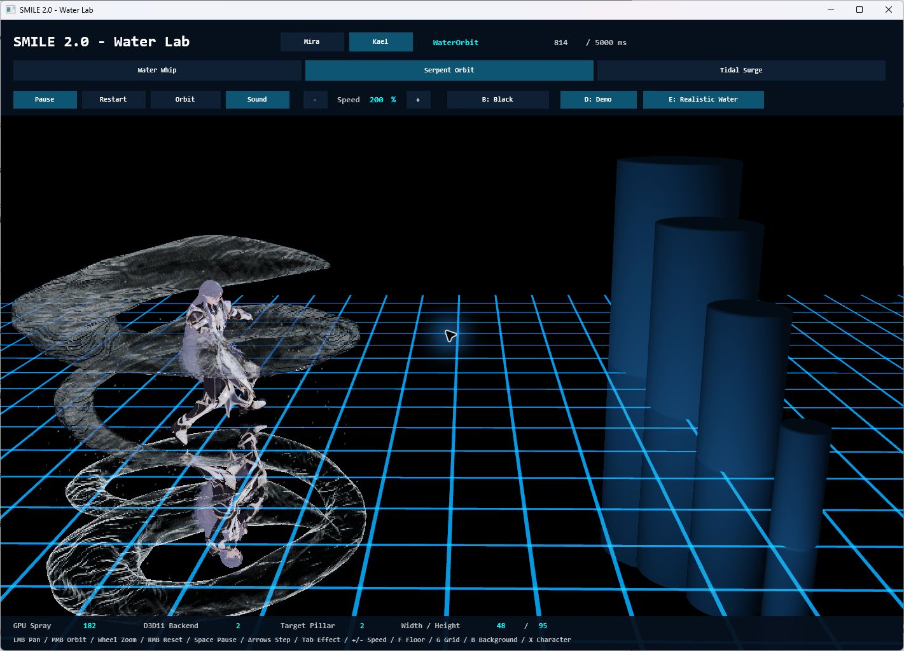</td>
    <td width="50%">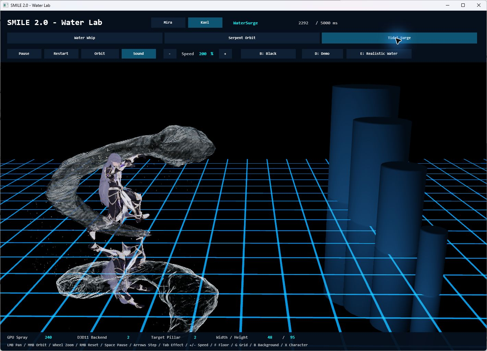</td>
  </tr>
  <tr>
    <td><strong>Serpent Orbit</strong><br>Coiling water surrounds the caster, shown with Realistic Water enabled.</td>
    <td><strong>Tidal Surge</strong><br>A broad curved flow follows the cast before reaching the selected pillar.</td>
  </tr>
</table>

Impacts can split around the smaller cylindrical targets and reunite behind them;
the largest target uses a crown splash. These are authored real-time effects with
explicit target bounds. The Lab also retains Mira's eight effect previews and
provides pause, 100 ms stepping, speed controls and a live clip clock for inspection.
Shared water modules own flow, impact geometry and spray independently of the actor.

**Current status:** Kael's three Water casts are already used in the native
Character Viewer and Sin Star I's normal/Earth/Water party rotation.

[Explore Water Lab and its controls](tools/WaterVfxLab/README.md)
· [Inspect the shared water effect](libraries/Smile.Simple3D/WaterVfx3D.smile)

## Kael — from character package to elemental opponent

Kael's current native package brings together **sixteen animation clips**, a
silver-haired character, a fitted sword, and separate solo and boss presentations.
The Kael Party demo alternates sword attacks with Earth and Water casts, using
his own assets and timing.

| Element | Current native progress |
| --- | --- |
| **Earth** | Boulder Hurl, Stone Volley and Fault Line in Earth Lab, the Viewer and Sin Star I. |
| **Water** | Water Whip, Serpent Orbit and Tidal Surge in Water Lab, the Viewer and Sin Star I. |
| **Fire** | Ember Strikes, Flame Sweep and Inferno Blast in a separate Fire Lab preview; adoption into Kael's Viewer/game rotation is pending. |

[Kael's versioned package](games/SinStarI/SourceAssets/Characters/Kael/KaelV1/README.md)
· [Water Lab](tools/WaterVfxLab/README.md)
· [Fire Lab](tools/AdvancedFireVfxLab/README.md)

## Vrax — a different kind of boss encounter

Vrax brings a mechanical silhouette, **24 animation clips**, six attack variants,
orange fire breath and blue-white arm lightning. His individual preview and party
encounter make it possible to inspect animation, targeting, effects and attack
sound cues in context.

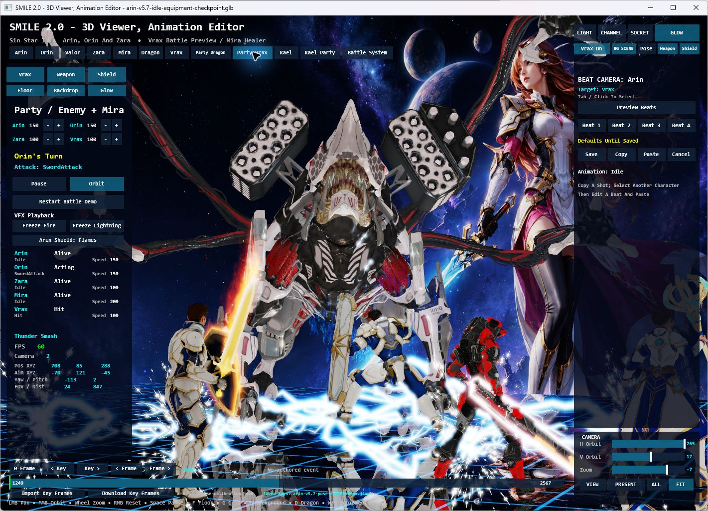

*Party Vrax — character scale, equipment effects, lightning and reflections working together.*

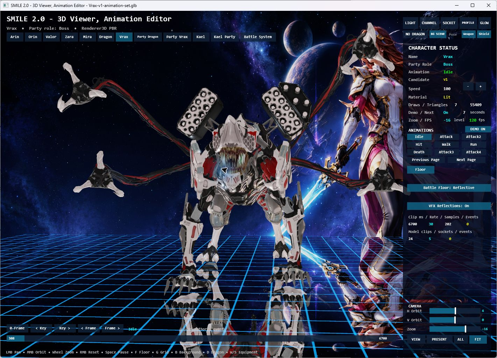

*Vrax's individual animation view, with clip selection, playback information and camera controls.*

[Explore Vrax's effects](tools/Character3DViewer/README.md#vrax-attacks)
· [Read the asset and audio integration journey](games/SinStarI/SourceAssets/Bosses/Vrax/VraxV1/VRAX-CREATION-AND-REPAIR-JOURNEY.md)

## The Red Dragon — animation, fire and party reactions

The Red Dragon remains a living test of the whole scene: wings and claws,
head and mouth targeting, breath and fireball effects, defensive reactions,
and multiple independently animated heroes.

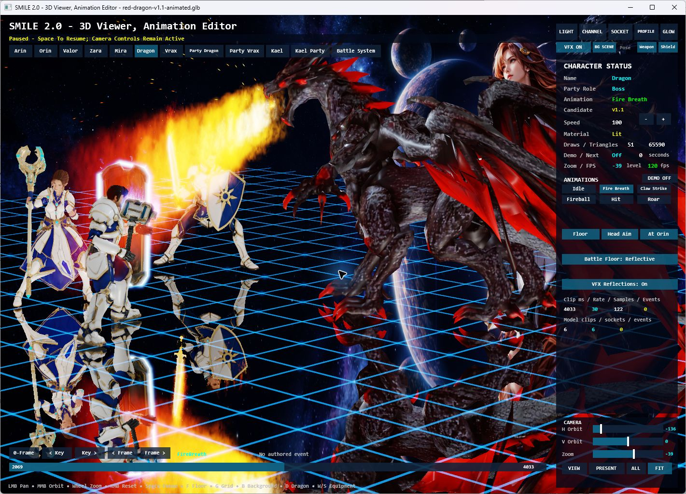

*Fire breath in the native Viewer, paused for inspection with the camera still available.*

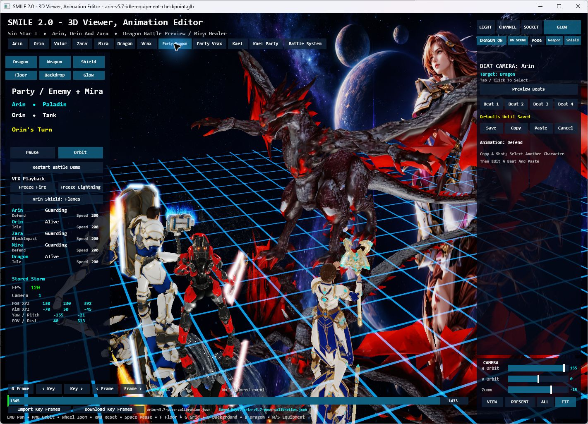

*The current Party Dragon scene brings the four-character roster into the same shared arena.*

The dragon uses a lightweight preview rig. The goal is to make each animation,
attachment, effect and camera decision useful to the developing game, while
keeping the editor focused and responsive.

[Dragon package and rig notes](games/SinStarI/SourceAssets/Bosses/RedDragon/RedDragonV11/README.md)
· [Character Viewer workflow](tools/Character3DViewer/README.md)

## Sin Star I — from script to screen

Sin Star I's development also reaches beyond the runtime: an illustrated script,
a visual storyboard, animated scene previews and video production explore the
characters, worlds and emotional stakes of the RPG.

### Watch the trailer

<p align="center">
  <a href="https://www.youtube.com/watch?v=IuDbnSnKEPo">
    
  </a>
</p>

<p align="center"><strong><a href="https://www.youtube.com/watch?v=IuDbnSnKEPo">▶ Watch Sin Star — Trailer (2026)</a></strong></p>

*The trailer presents Sin Star I's cinematic vision; the native screenshots above show current runtime development.*

### The illustrated story

<p align="center">
  <a href="https://github.com/Sincioco/SinStarI">
    
  </a>
</p>

*Story illustration — the duel that follows Arin into his dreams.*

<p align="center">
  <a href="https://github.com/Sincioco/SinStarI">
    
  </a>
</p>

*Story illustration — A World Hurled: Aevos, the party, and Mira's shield.*

The dedicated [Sin Star I repository](https://github.com/Sincioco/SinStarI)
contains the illustrated script, storyboard and production materials. Its current
storyboard has **122 illustrations across 53 scenes**, connected to script dialogue
and scene navigation. The local creative workspace also supports animated image
previews, clip variations and a Video Clips sequence-review view.

[Explore the Script, Storyboard and Video Clips guide](https://github.com/Sincioco/SinStarI/blob/main/Visual%20Script%20and%20Storyboard/Start%20Here.md)
· [Browse the production materials](https://github.com/Sincioco/SinStarI/tree/main/Visual%20Script%20and%20Storyboard/production)
· [Explore the native Sin Star I project](games/SinStarI/README.md)

Video files stay outside Git. The trailer above is publicly watchable on YouTube;
the story repository explains local playback and the available online versions.

## What is being built underneath

The scenes above are the visible result of work across the full toolchain.

| Layer | What the repository demonstrates |
| --- | --- |
| **Language and compiler** | A shared lexer, parser, diagnostics, types and semantic model; readable BASIC-inspired source; native Windows compilation. |
| **Runtime and rendering** | Permanent 2D support alongside 3D characters, skeletal animation, materials, planar reflections, particles, input and audio. |
| **Reusable SMILE libraries** | Camera and arena controls, animation/equipment workflows, effects, UI and RPG systems with explicit state ownership. |
| **Visual Studio tooling** | SMILE projects, compiler integration, language services, templates and a VSIX. |
| **Asset and editing workflow** | Versioned character packages, grounding checks, sockets, timeline inspection and saved pose corrections for supported characters. |
| **Creative production** | Sin Star I's script, storyboard, character direction, scene previews and trailer. |

**Windows native development is priority one.** Web compilation is an existing
second target sharing the language front end. Recent native features shown here
must not be assumed to have reached Web: **all Web adoption, publication and
browser validation are on hold**.

### SMILE 2.0 Studio status

Studio has a bounded hosted Viewer and Character Editor using the shared Viewer
session. **Studio creation, development, final interaction acceptance and next
phases remain on hold.** The standalone Viewer and labs shown above are the current
working tools. General scene documents, reusable saved-effect/audio documents,
declarative scene authoring and faithful scene export remain planned.

The [accepted Studio architecture](docs/architecture/2026-09-09%20-%20SMILE%202.0%20Studio.md)
and [working visual design](docs/architecture/studio-visual-design.md) describe the
direction, not completed product capabilities. Future work resumes only on Sin's
direction; see the [Studio implementation status](tools/SmileStudio/README.md) and
[current adoption checkpoint](docs/implementation/party-beat-camera-checkpoint.md).

## Build and explore

The core Windows toolchain uses Windows components and Visual Studio tooling.
Start with **Windows 11 x64**, **PowerShell 7**, **.NET SDK 10.0.400** (selected by
`global.json`), and **Visual Studio 2026** with Desktop development with C++ and
Visual Studio extension development.

Check prerequisites, then build the compiler and extension:

```powershell
pwsh -NoProfile -ExecutionPolicy Bypass -File scripts\doctor.ps1
.\scripts\build.cmd
```

Primary outputs:

```text
artifacts\compiler\smilec.exe
artifacts\vsix\Smile.VisualStudio.vsix
```

For the native character workflow, follow the
[Viewer build and asset-preparation guide](tools/Character3DViewer/README.md#build-and-launch).
Some featured characters use locally licensed source assets that are not included
in Git; the guide explains the roster and preparation requirements. With those
prerequisites prepared:

```powershell
pwsh -File tools\Character3DViewer\Launch.ps1 -Build
```

[Language documentation](docs/language/README.md)
· [Libraries](docs/libraries/README.md)
· [Architecture](docs/architecture/README.md)
· [Earth Lab build and controls](tools/EarthVfxLab/README.md)

## Work with Sin

**Louiery R. Sincioco (Sin)** creates and programs SMILE 2.0 and leads Sin Star I's
creative direction, with Codex collaboration. This repository makes the work
visible from language design and low-level rendering through artist-facing tools
and game presentation.

- **Employers and clients:** explore the compiler, runtime, tooling and native demonstrations as examples of Sin's engineering work. Get in touch about roles or projects that need those skills.
- **Partners and investors:** discuss the long-term direction for an approachable programming language, creative tools and the developing Sin Star I experience.
- **Contributors:** review the architecture and current task boundaries, then discuss a focused improvement to the language, native tools, documentation or character workflow.

**Interested in working together?** [Email Sin](mailto:louiery@gmail.com)
or [connect on LinkedIn](https://linkedin.com/in/louierysincioco).

[GitHub](https://github.com/Sincioco)
· [YouTube](https://youtube.com/@TheSincioco)
· [Facebook](https://facebook.com/louiery.sincioco)
· [TikTok](https://tiktok.com/@sincioco)

---

**SMILE 2.0 — Simple Modern and Intuitive Language for Everyone.**

Copyright(c) 2026. All rights reserved. Programmed by Louiery R. Sincioco (Sin).
