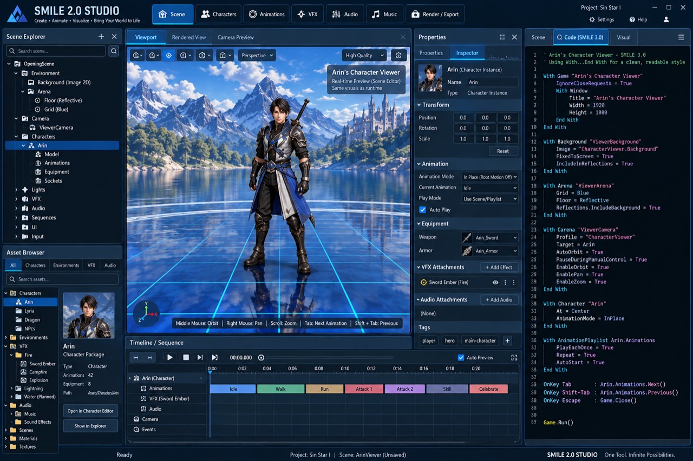

# SMILE 2.0 Studio — Current Working Visual Design

**Design designated by:** Sin, September 10, 2026.

**Status:** Current working visual authority until Sin explicitly revises or replaces it.

**Source:** User-supplied `Photo 1.jpg`, preserved unchanged in this repository.

**Scope:** Product appearance, workspace composition and interpretation of visible controls.

## Authority and how to use this reference

Read this document and inspect the original image before Studio UI design or
implementation. Build toward this composition and visual language in bounded
slices. A temporary implementation limitation does not silently replace the target.
Update this record when Sin explicitly changes the design; do not promote an
assistant-generated alternative to the current reference without that direction.

The [accepted Studio architecture](2026-09-09%20-%20SMILE%202.0%20Studio.md)
continues to govern module ownership, document semantics, shared runtime behavior
and exports. The [root README](../../README.md#smile-20-studio-current-status-and-next-action)
is the implementation-status entry point; verify current source and focused evidence
when choosing implementation work. This image is a design reference, not a screenshot
proving that all shown functionality already works.

The tables below separate visible elements from their **interpreted purpose**.
Inferred behavior is a proposed reading of the image, not additional user approval
of every detail. The image cannot establish hidden menus, exact icon actions,
shortcuts beyond those printed, docking behavior, save semantics or supported grammar.

## 1. Overall composition and visual language

This is one integrated desktop creation environment. The central scene remains
visible while the user selects assets, inspects an object, reads source and adjusts
timing. The example is Arin's character scene in Sin Star I; Studio itself remains
a general-purpose editor for other scenes and projects.

| Region | Visible design and intended role |
|---|---|
| Full-width header | Product identity at left, workspace buttons across the top, project and utility controls at right. |
| Left column | Scene Explorer above Asset Browser: the current scene's contents and the project's reusable resources. |
| Main center | The largest pane is the live scene viewport, with mode tabs and compact view controls. |
| Center-right column | A narrow Properties/Inspector panel stays beside the viewport for precise edits to the selected object. |
| Far-right column | A tall Scene/Code/Visual panel; Code is selected in the reference. |
| Lower center | Timeline/Sequence spans below the viewport and Inspector. The left asset browser and right source panel continue alongside it. |
| Bottom edge | Ready state, project/scene identity, unsaved indication and Studio branding. |

The palette is dark navy and blue-black with steel-blue panel headers, thin blue
borders, bright cyan/blue active selections, small white icons and pale text.
The typography is compact and readable; labels accompany major workspace icons.
Panels are tightly arranged with consistent gutters and modest corner rounding.
The brightly lit scene supplies the main color and visual focus. Resizing dividers
are a plausible implementation, but movable docking is not established by the image.

## 2. Header and workspace navigation

| Visible element | Interpreted purpose |
|---|---|
| Blue geometric mark and `SMILE 2.0 STUDIO` | Persistent application identity. Implementation must use the [official SMILE logo](../../assets/branding/smile-2.0-logo.png); this mockup does not replace that asset. |
| `Create • Animate • Visualize • Bring Your World to Life` | A short description of Studio's creative workflow. |
| `Scene`, highlighted blue | Active scene composition workspace: place objects, cameras, environments and timed presentation. |
| `Characters` | Access character inspection and supported character preparation/editing within Studio. |
| `Animations` | Access clip inspection, playback and supported animation/keyframe corrections. |
| `VFX` | Access reusable effects and the specialized effect-family workflows. |
| `Audio` | Access sound effects and audio cue authoring/auditioning. |
| `Music` | Direct access to music selection and supported playback/cue settings. It is a separate visible entry here, while sharing the accepted Audio ownership. |
| `Render / Export` | An output entry point. Faithful scene/source export follows the accepted architecture; supported still/video rendering and output formats are not specified by the image. |
| `Project: Sin Star I` | Identify the currently open project. The image does not prove that the label is a project-switching menu. |
| `Settings`, `Help`, person icon | Configuration, assistance and likely profile/account access. The person icon alone does not establish a login requirement or online service. |
| Minimize, maximize, close | Standard window controls. |

## 3. Scene Explorer — upper left

The hierarchy answers: **What is in this scene, and which instance am I editing?**

| Visible element | Interpreted purpose |
|---|---|
| `Scene Explorer` header, plus and close icons | Name the panel, likely add a scene item, and hide/close the panel. Exact plus-menu contents are unspecified. |
| `Search scene...` field and magnifier | Filter or locate items in the current hierarchy. |
| Disclosure arrows, indented rows and type icons | Expand/collapse groups and communicate parent-child relationships and object types. |
| `OpeningScene` | Root of the illustrated scene hierarchy. |
| `Environment` → `Background (Image 2D)` | A scene background image, consistent with keeping 2D content alongside 3D. |
| `Arena` → `Floor (Reflective)`, `Grid (Blue)` | Ground/staging surface, reflection presentation and a visible spatial guide. These belong to the example composition, not every scene. |
| `Camera` → `ViewerCamera` | An authored or configured camera used to frame the scene. |
| `Characters` → selected `Arin` | Arin's placed scene instance. The blue selection should identify the same subject shown in the viewport and Inspector. |
| Arin → `Model`, `Animations`, `Equipment`, `Sockets` | Inspect the character's visual model, clip collection, equipped resources and attachment points. |
| `Lights` | Scene illumination objects/settings. |
| `VFX` | Effects placed in or attached within the scene. |
| `Audio` | Scene audio objects or cue bindings. |
| `Sequences` | Timed scene actions or playback arrangements. |
| `UI` | Scene-associated interface, HUD or overlay content. |
| `Input` | Scene/application input bindings. The exact editable binding model is unspecified. |

The Explorer operates on scene instances. Editing a source character or reusable
effect must remain an explicit action, following the architecture's distinction
between source edits, scene overrides and saving a new asset.

## 4. Asset Browser — lower left

The browser answers: **What reusable resources can I use?** It is distinct from
the Explorer's list of items already placed in the scene.

| Visible element | Interpreted purpose |
|---|---|
| `All`, `Characters`, `Environments`, `VFX`, `Audio` tabs | Filter the resource catalog by broad category. `All` is selected. |
| `Search assets...` | Find resources by name or supported metadata. |
| Folder/category tree | Browse project resources hierarchically. |
| `Characters` → `Arin`, `Lyria`, `Dragon`, `NPCs` | Example character resources and grouping. These names do not mandate a new roster or new packages. |
| `Environments` | Reusable environment/background resources. |
| `VFX` → `Fire` → `Sword Ember`, `Campfire`, `Explosion` | Example reusable fire effects or presets. |
| VFX → `Lightning`, `Water (Planned)` | Additional effect families; the image explicitly marks Water as planned. |
| `Audio` → `Music`, `Sound Effects` | Browse media and reusable audio definitions within the accepted common audio model. |
| `Scenes`, `Materials`, `Textures` | Other reusable project resources. |
| Arin portrait and `Character Package` detail card | Preview and identify the selected resource. |
| `Type: Character`, `Animations: 42`, `Equipment: 8`, asset path | Display catalog metadata. Counts and the depicted `Assets/Characters/Arin` path are illustrative, not verified inventory or a replacement for canonical versioned package ownership. |
| `Open in Character Editor` | Open the resource in Studio's character-editing workflow. The label does not require a separate application. |
| `Show in Explorer` | Likely reveal the resource in the filesystem; which Explorer surface is intended remains unspecified. |

Adding an asset to the scene is a natural workflow, but drag-and-drop, double-click
placement and context-menu commands are not shown and are not fixed by this reference.

## 5. Live viewport — main center

| Visible element | Interpreted purpose |
|---|---|
| `Viewport`, selected | Interactive working scene view. |
| `Rendered View` | Likely a presentation-oriented view of the same scene. The exact difference from Viewport needs specification. |
| `Camera Preview` | Inspect the composition through an authored scene camera. |
| Compact icon toolbar with dropdown arrows | View/navigation/display controls. Several symbols are too small or ambiguous to assign exact commands confidently. |
| `Perspective` dropdown | Select projection or view orientation. Available alternatives are unspecified. |
| `High Quality` dropdown | Select preview rendering quality. This label does not establish particular renderer features or target parity. |
| Small camera-like button at upper right | Likely capture/snapshot or camera-related action; exact behavior is unconfirmed. |
| Arin centered and fully visible | Inspect silhouette, materials, pose, equipment and ground contact. The scene supports both broad visual review and precise changes through the Inspector. |
| Snowy mountains, lake, forest and distant castle | Example scenic background/environment. This does not request terrain generation or a world-modeling system. |
| Glossy floor, reflected character/environment and cyan grid | Communicate grounding, reflection quality, scale and spatial orientation. Existing fixed-background/reflection semantics still apply. |
| Lower-left X/Y/Z orientation gizmo | Show world/view orientation while the camera moves. Clickable axis shortcuts are not confirmed. |
| `Arin's Character Viewer` overlay | Identify this preview and its character-viewing use within Scene Editor. |
| `Real-time Preview (Scene Editor)` / `Same visuals as runtime` | The desired preview should use the shared runtime and faithfully represent runtime behavior. The text is an intended contract, not validation evidence. |
| Printed input strip | `Middle Mouse: Orbit`, `Right Mouse: Pan`, `Scroll: Zoom`, `Tab: Next Animation`, `Shift + Tab: Previous`. These are the visible target hints; reconcile actual controls deliberately when implementing. |
| Pane close icon | Likely hide/close the view panel; it must not imply silently discarding a document. |

Camera interaction must retain the repository's smooth-motion and bounded-zoom
requirements. The existing application startup must still show the official logo
for at least one visible second; a screenshot of the working interface cannot show
that separate startup requirement.

## 6. Properties / Inspector — beside the viewport

This panel answers: **What is selected, and what can I change precisely?**
Its sections have disclosure arrows so longer settings can be collapsed.

| Visible element | Interpreted purpose |
|---|---|
| `Properties` pane title; `Properties` and selected `Inspector` tabs | Contextual views for the selected item. Their exact division is not established. Header options and close icons manage the panel. |
| Portrait, `Arin (Character Instance)`, `Name: Arin`, `Type: Character Instance` | Confirm selection identity and distinguish a placed instance from the source character package. |
| `Transform`: Position, Rotation, Scale | Three numeric components per row, interpreted as X/Y/Z. Position and Rotation show zeros; Scale shows ones. Units and coordinate conventions require the shared contract. |
| `Reset` | Likely restore transform defaults; exact reset scope and undo behavior require specification. |
| `Animation Mode: In Place (Root Motion Off)` | Choose whether motion translates the character or keeps it in place for preview/scene playback. Displaying this option does not prove every root-motion mode exists. |
| `Current Animation: Idle` | Choose the active clip. |
| `Play Mode: Use Scene/Playlist` | Let the scene sequence or character playlist govern playback. |
| `Auto Play`, checked | Start appropriate preview playback automatically. Timing/lifecycle must follow the shared preview session. |
| `Equipment`: Weapon `Arin_Sword`, Armor `Arin_Armor` | Assign or inspect equipment resources, with thumbnails/icons and dropdown selectors. |
| `VFX Attachments`, `+ Add Effect` | Bind an effect to the selected instance or one of its attachment points. |
| `Sword Ember (Fire)` row, eye icon and overflow/handle-like controls | Identify the attached effect, likely toggle visibility and expose more actions. Socket selection and exact small-icon behavior are not shown. |
| `Audio Attachments`, `+ Add Audio`, `(None)` | Add or inspect associated audio cues. No audio attachment is currently listed. |
| Tags `player`, `hero`, `main-character`, plus button | Label the object for organization or supported lookup/filtering. Tags do not inherently implement gameplay rules. |

## 7. Scene / Code / Visual panel — far right

| Visible element | Interpreted purpose |
|---|---|
| `Scene`, `Code (SMILE 3.0)`, `Visual` tabs | Related scene representations or editing modes. Code is selected. The other tabs' content is not visible. |
| Magnifier beside Code and upper-right menu icon | Likely source search and panel/document actions; menu contents are unspecified. |
| Dark source surface, line-number gutter and syntax colors | Readable source presentation with comments, keywords, strings, values and object/property names visually separated. Repeated/inconsistent line numbers are mockup artifacts. |
| Game/window setup, including 1920 × 1080 values | Describe the example program/window configuration. Those values do not fix Studio's window size or logical canvas. |
| Background and Arena blocks | Describe the background image, blue grid, reflective floor and reflected background. |
| Camera block targeting Arin | Describe a character-viewer camera profile, automatic orbit, pausing during manual control, and enabled orbit/pan/zoom. |
| Character block | Place Arin at the center and request in-place animation. |
| Animation playlist block | Play the listed animations once per traversal, repeat the playlist and start automatically. This is interpretation of the pictured properties. |
| Tab / Shift+Tab / Escape handlers | Advance a clip, return to the previous clip and close the example program. These are pictured example-program bindings, not blanket Studio shortcuts. |
| Final run call | Start the example program's execution. |

The intent is to make the relationship between a visual scene and readable SMILE
understandable in the same workspace. The reference does **not** prove an editable
code pane, arbitrary source import, live code execution, automatic regeneration or
lossless two-way source/visual synchronization.

The literal `SMILE 3.0` heading/comment is preserved in the original image for
fidelity, but the requested product is **SMILE 2.0 Studio**. Use the current product
identity in implementation. The pictured `With` blocks, properties, event syntax
and run call are illustrative; do not copy them into documentation as verified
compilable SMILE. The shared language implementation is the grammar authority, and
the accepted export/source-ownership rules remain in force.

## 8. Timeline / Sequence — lower center

This panel answers: **What happens when, and how do the scene's moving parts line up?**

| Visible element | Interpreted purpose |
|---|---|
| `Timeline / Sequence` header | A scene timing and preview workspace. |
| Transport icons | Recognizable play and stop controls plus likely jump/step navigation. Exact destinations and step sizes are not legible. |
| `00:00.000` time readout | Current preview position with subsecond precision. |
| Circular control and horizontal slider | A playback/navigation adjustment; whether it controls scrub position, range or zoom is not established. |
| `Auto Preview`, checked | Preview relevant timeline changes automatically. |
| Four-corner icon | Likely maximize/focus the timeline panel. |
| Time ruler around 0:00 through 0:20 and blue playhead | Locate the current instant and compare event timing. Exact clip durations are illustrative. |
| Expandable `Arin (Character)` track group | Group the selected character's timed tracks. |
| `Animations` track | Arrange character clip playback in order. |
| Colored `Idle`, `Walk`, `Run`, `Attack 1`, `Attack 2`, `Skill`, `Celebrate` blocks | Distinguish clip segments and their sequence. Their colors improve scanning; no universal color semantics are specified. |
| `VFX (Sword Ember)` and `Audio` tracks | Coordinate effect activation and sound with animation. Empty rows do not prove cues are already authored. |
| `Camera` track | Coordinate camera changes or movement with the sequence. |
| `Events` track | Schedule other supported scene actions or bindings. These are not necessarily combat rules. |
| Grid and lower horizontal scrollbar | Align tracks and navigate a longer sequence. |

Scrubbing, selecting, moving and trimming clips are likely authoring interactions,
but the exact edit gestures, snapping rules, transitions, keyframes and blending
are not determined by the static image. Timing should feed the accepted shared
sequence/runtime model, with one active preview session rather than independent
timers in each pane.

## 9. Bottom status bar

| Visible element | Interpreted purpose |
|---|---|
| `Ready` | Application activity/readiness feedback. |
| `Project: Sin Star I` | Confirm the active project. |
| `Scene: ArinView (Unsaved)` | Identify the current document and show that it has unsaved work. The hierarchy uses `OpeningScene`; whether that is a separate root name or placeholder inconsistency is not established. |
| `SMILE 2.0 STUDIO` and `One Tool. Infinite Possibilities.` | Persistent product identity and footer tagline. |

## 10. Intended end-to-end user experience

1. Open a project and choose the relevant Studio workspace.
2. Find a reusable resource in the Asset Browser and use it in a scene.
3. Select its scene instance in the Explorer or viewport.
4. Inspect it live and adjust supported properties beside the viewport.
5. Coordinate animations, effects, sound and camera actions on the timeline.
6. Inspect the corresponding readable source where that capability is implemented.
7. Save the authoritative document or explicitly export supported output, with
   clear ownership and unsaved-state feedback.

The key visual relationship is **one selection, one scene preview and coordinated
panels inside one Studio window**. Character inspection remains fast, while deeper
editing is reachable in the same environment. The screenshot is the destination
for composition and appearance; each functional slice still needs current support
and focused validation before it can be reported as implemented.

## Original image provenance

- Repository image: `docs/architecture/images/smile-2.0-studio-working-design-2026-09-10.jpg`.
- Original attachment display name: `Photo 1.jpg`; stored attachment filename: `1-Photo-1.jpg`.
- Dimensions: 1280 × 853 pixels.
- File size: 323,480 bytes.
- SHA-256: `0F09C0B81F27F6D68D24321B8A20149BA46F2454F8DD8ADAD2B244B478F24BF7`.
- Copied byte-for-byte; no crop, retouch, recreation or recompression.
