# M7E-G0 native evidence index

Encoding: Windows capture supplied JPEG images. Images 01–12 are lossless PNG
transcodes of those decoded capture pixels (not lossless original framebuffer
captures). Image 13 is a Blender PNG. Image 14 resizes the evidence into a phone
contact sheet. The originals are retained in the handoff ZIP.

Revision: the G0 commit containing this index; baseline `a7fb138189e407f81f6dd096c0fd79738edb7ac4`. Captured from the modified native Debug build before committing; no source/model or saved pose changes were made between these captures and that commit.

## Shared candidate identity

- Asset: `sin-star-i.character-1.paladin`; candidate: `v5.7`.
- GLB: `393D82C06ECCEDF5A13CF3CA835700AA03A6E90ED74B1420569902885E3E1524`.
- Descriptor: `05B8B081FDC1A7CD3ACA70F37D1AEF4BD3377FE6050B8ABE0A8C79AC5462D119`.
- SM3D: `DC623A682631525C9E921C62E92A21A99C770A1A9C9BFF3E3FD64CEA2F2539B5`.
- Calibration JSON: `6FE2268E390D228AF4F52AF85E5358B66ACF8DE606D60C514FAC6CA0CF8B51B1`; 23 saved keys.
- Viewer captures 01–10: native D3D11 GPU thermal, requested/effective High, one sword plus three shield emitters: 20 systems / 6,656 reserved slots. Soft depth enabled, localized distortion enabled (quality 2), Scene3D High/HDR policy. Runtime FPS is a momentary observation, not a universal performance claim. Logical live particles vary; they were not individually sampled from the Viewer HUD. No GPU timer/readback was added for screenshots.
- No unsaved calibration preview was authored. Wrist/equipment state below is the exact saved key, or the held Walk frame-0 correction for frame 19. World animation and camera transforms differ as shown.
- Filenames retain the requested “approved” wording; this means the user-authored saved pose, not a claim of new visual approval for G0 changes.
- Known limitations: small-window right-panel statistics overlap camera rows; model holes remain production-blocking; some anatomical sockets are legitimately occluded. Images prove selected instants, not continuous stability by themselves.

## 01-v57-idle-approved-pose.png

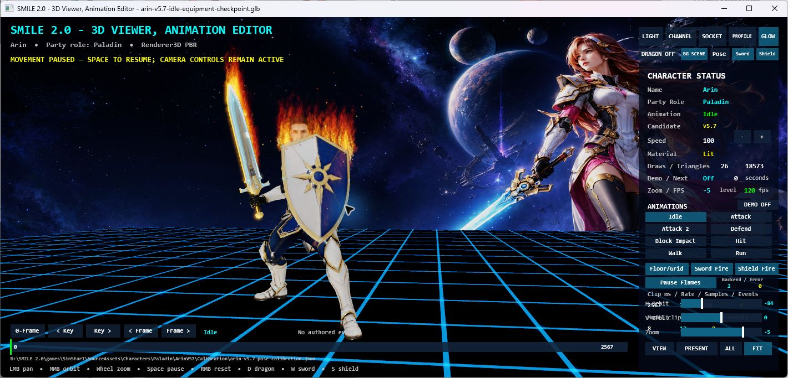

- Clip/frame: `Idle / 0`. Saved pose, scene paused, both flames running; dragon hidden.
- Capture: 09/04/2026 16:23:44; 1420 × 683, 1660705 bytes.
- SHA-256: `4fb7d0863c4c6be6ac75802ae9afdc13e7d98716adf234bcefc03940ca0f9a63`.
- Sword decoupled: `True`; rotation XYZ `[0, 0, 0]`; movement XYZ `[-1, 0, 2]`.
- Shield decoupled: `False`; rotation XYZ `[24, -31, -45]`; movement XYZ `[0, 3, -6]`.
- Wrist rotation XYZ: sword `[28, -134, 29]`, shield `[12, 129, 19]`.

## 02-v57-walk-frame-0.png

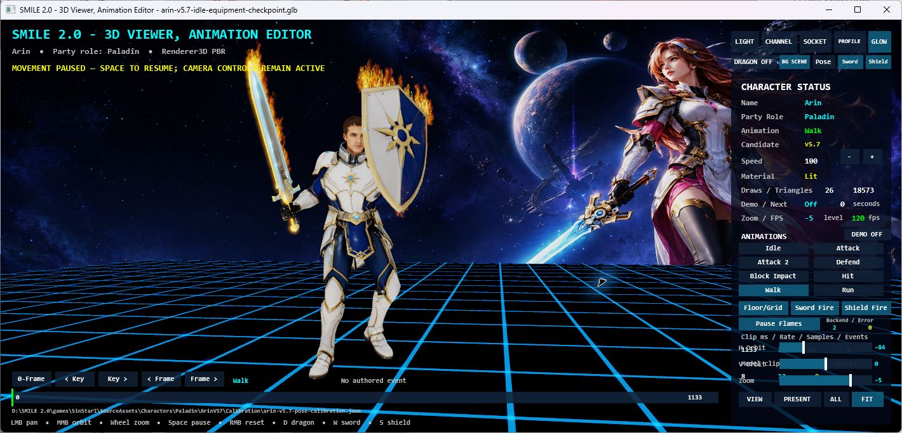

- Clip/frame: `Walk / 0`. Saved Walk frame 0; no pose modifications.
- Capture: 09/04/2026 16:24:14; 1420 × 683, 1679249 bytes.
- SHA-256: `e44b82a88909f6e79045fb88803c650de453c9a643cd05cb6f2dbb6172dbec5c`.
- Sword decoupled: `True`; rotation XYZ `[13, 0, 0]`; movement XYZ `[-2, 0, 1]`.
- Shield decoupled: `True`; rotation XYZ `[-112, 7, 0]`; movement XYZ `[0, -5, 4]`.
- Wrist rotation XYZ: sword `[58, -130, 0]`, shield `[0, 144, 0]`.

## 03-v57-walk-frame-19.png

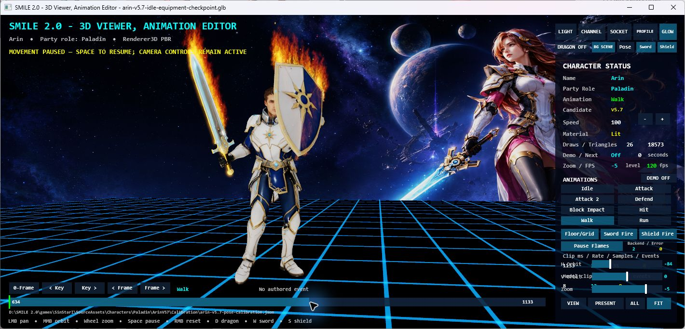

- Clip/frame: `Walk / 19`. 634 ms seek: evaluated frame 19, held correction from the sole Walk frame-0 key; no historical frame-19 key restored.
- Capture: 09/04/2026 16:24:53; 1420 × 683, 1698674 bytes.
- SHA-256: `22a65b3df342eb380e8a7607d7fdd4e5aa249cea9573c2f4c807bc3dd07020c7`.
- Sword decoupled: `True`; rotation XYZ `[13, 0, 0]`; movement XYZ `[-2, 0, 1]`.
- Shield decoupled: `True`; rotation XYZ `[-112, 7, 0]`; movement XYZ `[0, -5, 4]`.
- Wrist rotation XYZ: sword `[58, -130, 0]`, shield `[0, 144, 0]`.

## 04-v57-run-approved-pose.png

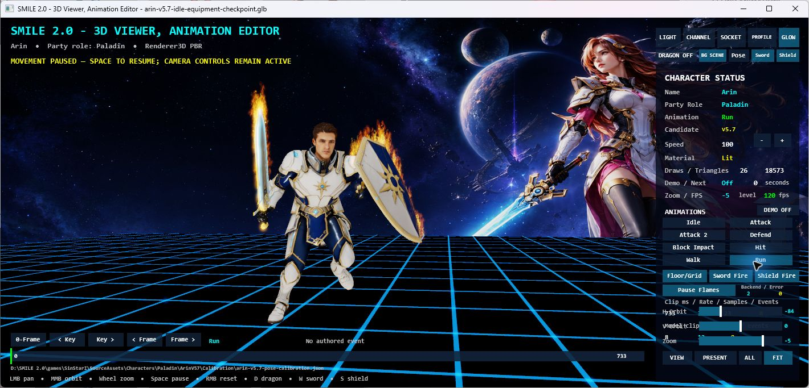

- Clip/frame: `Run / 0`. Saved Run frame-0 correction; paused after an explicit clip switch.
- Capture: 09/04/2026 16:25:07; 1420 × 683, 1649497 bytes.
- SHA-256: `9e72ca06d047b3ddd84fab0859abf398ded26f7090dbcc32ea478433aa7991e3`.
- Sword decoupled: `True`; rotation XYZ `[0, 0, 0]`; movement XYZ `[-1, -1, 2]`.
- Shield decoupled: `True`; rotation XYZ `[104, -130, 180]`; movement XYZ `[0, 0, 0]`.
- Wrist rotation XYZ: sword `[68, -130, 0]`, shield `[0, 180, 0]`.

## 05-v57-sword-attack-approved-pose.png

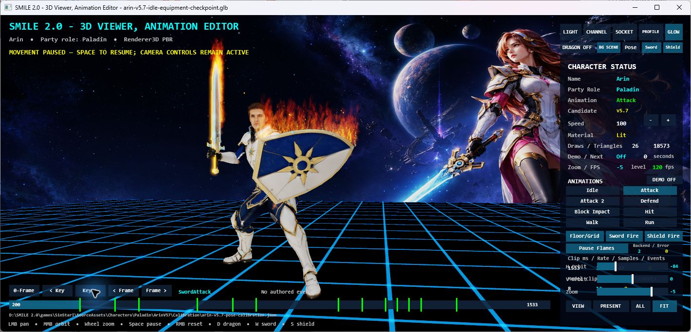

- Clip/frame: `SwordAttack / 6`. First saved Attack key at 200 ms. Key navigation preserved all 13 Attack keys.
- Capture: 09/04/2026 16:25:34; 1420 × 683, 1683641 bytes.
- SHA-256: `40b9188b478821fa9b02ece42225ef48f8f2d266e69fbf310d7332f864005a2c`.
- Sword decoupled: `True`; rotation XYZ `[-4, -28, 1]`; movement XYZ `[-1, -1, 1]`.
- Shield decoupled: `True`; rotation XYZ `[-61, -30, 44]`; movement XYZ `[0, 0, 0]`.
- Wrist rotation XYZ: sword `[10, -126, 59]`, shield `[0, 0, 0]`.

## 06-v57-sword-attack-2-approved-pose.png

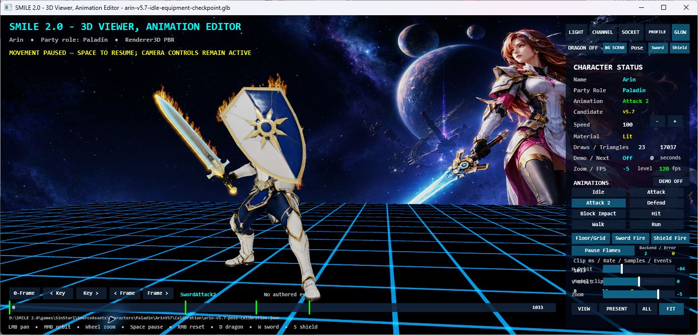

- Clip/frame: `SwordAttack2 / 0`. Saved Attack 2 frame 0; independent four-key clip. Fire is restarting after intentional navigation cut.
- Capture: 09/04/2026 16:25:50; 1420 × 683, 1666931 bytes.
- SHA-256: `b13ae80ec38875d41360d93b184b464b6e62a09dba994891fc09c9bad6ba17e8`.
- Sword decoupled: `True`; rotation XYZ `[29, 0, 0]`; movement XYZ `[-2, 0, 3]`.
- Shield decoupled: `True`; rotation XYZ `[-65, 16, 70]`; movement XYZ `[0, 0, 0]`.
- Wrist rotation XYZ: sword `[39, -142, 1]`, shield `[0, 137, 31]`.

## 07-v57-block-impact-approved-pose.png

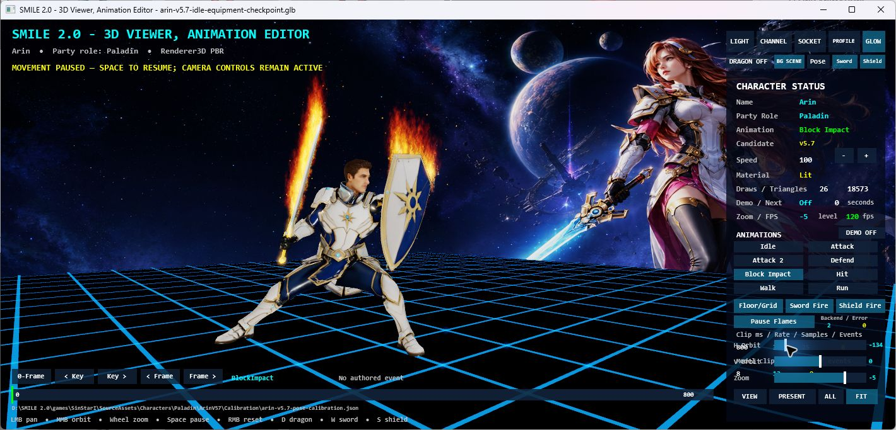

- Clip/frame: `BlockImpact / 0`. Saved Block Impact frame 0; side view exposes sword and shield.
- Capture: 09/04/2026 16:26:19; 1420 × 683, 1702694 bytes.
- SHA-256: `30cc1b0242cbd8d53f66e069d72413f8d8ee2152e8c7db706587d63540ab5943`.
- Sword decoupled: `True`; rotation XYZ `[0, -30, 0]`; movement XYZ `[1, -1, 3]`.
- Shield decoupled: `True`; rotation XYZ `[-74, 48, 68]`; movement XYZ `[3, -1, 2]`.
- Wrist rotation XYZ: sword `[50, -111, 9]`, shield `[0, 140, 16]`.

## 08-v57-hit-approved-pose.png

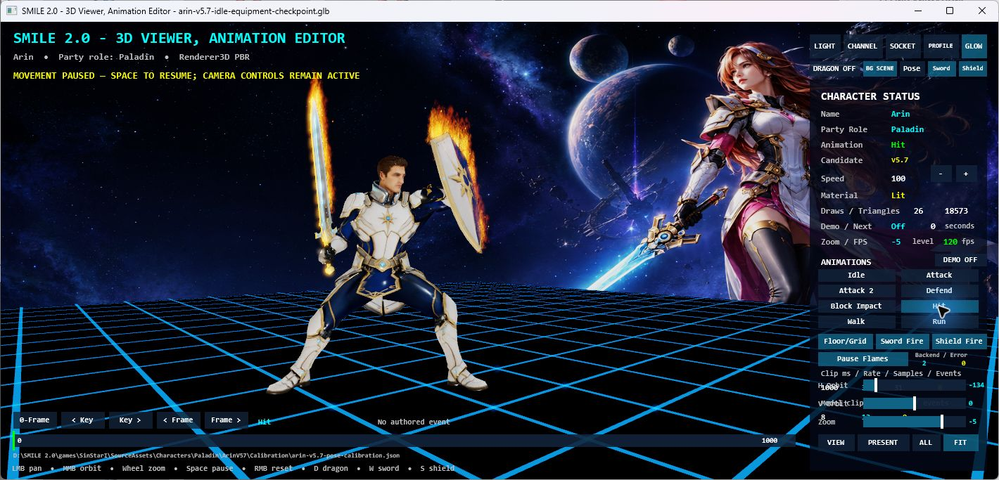

- Clip/frame: `Hit / 0`. Saved Hit frame 0; both independent flame attachments visible, no recovery error.
- Capture: 09/04/2026 16:26:33; 1420 × 683, 1694157 bytes.
- SHA-256: `0f0dc4f3b986b4f957c4c288f5f04d95a9fa58204757069eabc927c1ee7f70d7`.
- Sword decoupled: `True`; rotation XYZ `[0, -2, -10]`; movement XYZ `[-2, 1, 2]`.
- Shield decoupled: `True`; rotation XYZ `[-82, 37, 44]`; movement XYZ `[7, 0, 0]`.
- Wrist rotation XYZ: sword `[-2, -119, 55]`, shield `[0, 124, 14]`.

## 09-sword-fire-corrected-sockets.png

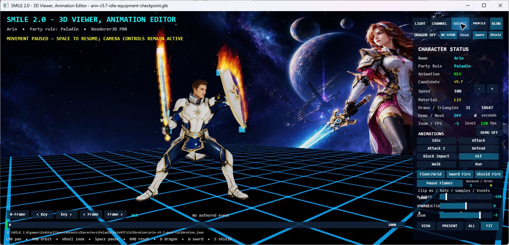

- Clip/frame: `Hit / 0`. All origins enabled: SwordBase/Tip and shield flame sockets use their visible corrected equipment parts; cyan markers align with blade and shield ends.
- Capture: 09/04/2026 16:27:34; 1420 × 683, 1709482 bytes.
- SHA-256: `25bb1050a830e96ff487cca6dbd5f1c36366c3565d2a8793dec873c58f7e1b69`.
- Sword decoupled: `True`; rotation XYZ `[0, -2, -10]`; movement XYZ `[-2, 1, 2]`.
- Shield decoupled: `True`; rotation XYZ `[-82, 37, 44]`; movement XYZ `[7, 0, 0]`.
- Wrist rotation XYZ: sword `[-2, -119, 55]`, shield `[0, 124, 14]`.

## 10-flame-pause-and-scene-pause.png

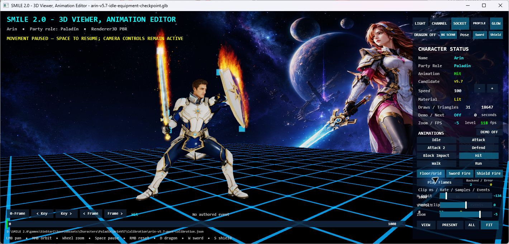

- Clip/frame: `Hit / 0`. Scene paused and flames separately paused; Play Flames button offers independent resume.
- Capture: 09/04/2026 16:27:51; 1420 × 683, 1710206 bytes.
- SHA-256: `0db7ca6fbe08eadfadfc4cd2452b8cc12671167b031c58a96e139b91cd8d5c8a`.
- Sword decoupled: `True`; rotation XYZ `[0, -2, -10]`; movement XYZ `[-2, 1, 2]`.
- Shield decoupled: `True`; rotation XYZ `[-82, 37, 44]`; movement XYZ `[7, 0, 0]`.
- Wrist rotation XYZ: sword `[-2, -119, 55]`, shield `[0, 124, 14]`.

## 11-profile-cycle-clean-reset.png

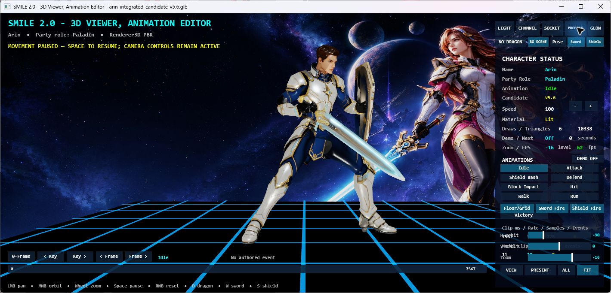

- Clip/frame: `Idle / 0`. Arin v5.6 after leaving v5.7: no v5.7 flames, no inherited saved calibration path, no recovery overlay.
- Capture: 09/04/2026 16:28:17; 1420 × 683, 1497261 bytes.
- SHA-256: `e3848ebce6d2d543973b85184e6aec7794b6ca47a4df6d2e651e5bd1351eeefb`.
- This image is v5.6, not the shared v5.7 identity. Calibration is not applied; equipment thermal fire is unavailable. It demonstrates cleared v5.7 state, not a newly approved v5.6 pose.
- v5.6 GLB: `A509CC1BCD7C90FFF7122B7E2F4DB9491F804FADA1C4F56F482CF63F9F076C59`;
  descriptor: `EBD234807CEE47816345DBCA1114E14CF5C1D86EF7AFEDC64E983B5BDBFA9CA6`;
  cooked SM3D: `717349D29D26BAC7C119BA3D6C931D006F80E14A34B7450EFB5A545B3303A157`.

## 12-fire-resource-budget-diagnostics.png

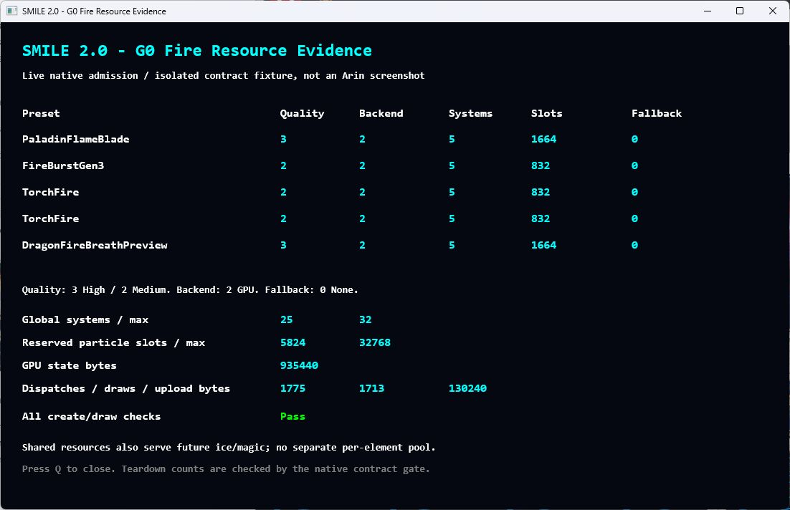

- Isolated native D3D11 contract fixture, not a character/profile pose. Model,
  calibration, wrist and equipment transforms do not apply.
- High sword, Medium impact, two Medium torches and High dragon breath all
  report GPU backend 2 and fallback 0; 25 systems / 5,824 reserved slots.
- GPU state: 935,440 bytes. Capture counters: 1,775 dispatches, 1,713 draws,
  130,240 upload bytes. These are cumulative counters at this instant, not FPS
  or GPU timings. CPU batches are not used for these five admitted effects.
- HDR/soft-depth/distortion settings are not the acceptance subject of this
  resource-only fixture; see the retained native thermal combination tests.
- 1102 × 712, 278,255 bytes.
- SHA-256: `526ADDCBF210DD15EA808AE0E290DE704F4AB2CAEB34DAC3450E3B42AB3BAEA1`.
- Proves complete concurrent admission and draws without hidden fallback, not
  production visual tuning of all five effects.

## 13-model-hole-diagnostic.png

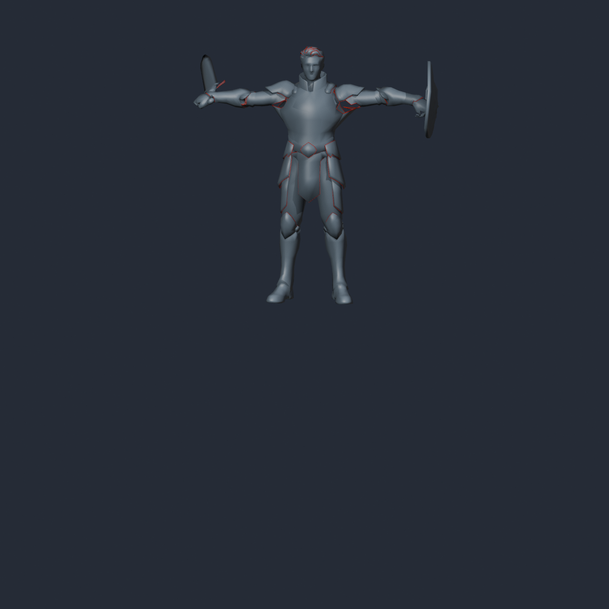

- Same v5.7 GLB hash as the shared identity. Unskinned Blender visualization,
  no calibration, scene clip, equipment correction, HDR or fire simulation.
- Gray source surfaces, red residual boundary edges after temporary diagnostic
  position welding. No model file is exported or repaired.
- 1280 × 1280, 1,470,791 bytes.
- SHA-256: `056AE061050674768EE1776CC4DA3C60886E96EDF63B085FEB1F178C486E407F`.
- Some boundary edges belong to intentional armor openings; counts alone do
  not distinguish them from visible holes. Production remains blocked.

## 14-iphone-contact-sheet.png

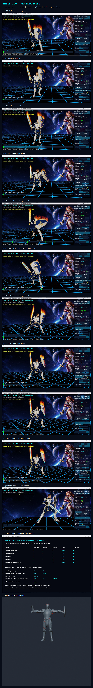

- Derived overview of images 01–13; refer to individual entries for identities,
  transforms, runtime settings and limitations. No new render is implied.
- 900 × 6608, 8,587,789 bytes.
- SHA-256: `64BFF147E8666B979239803DD4EABEE57EBEEDD8A844C1068B79E45F6121A361`.
- This is a phone-friendly scrollable summary; use original images for detail.

Capture timestamps in this index are UTC. The local acceptance date was
September 5, 2026 (Asia/Taipei).
